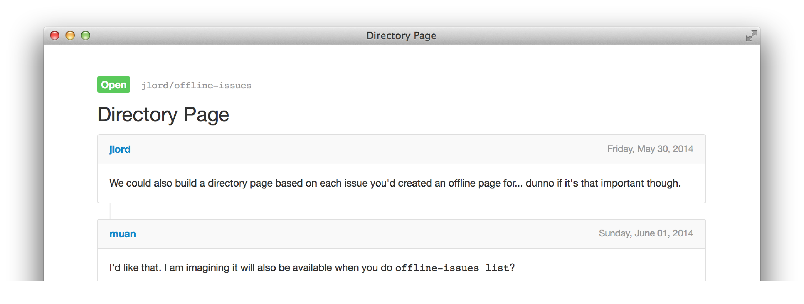

# offline-issues

Get your GitHub Issues offline! In Markdown and HTML.



## But how?

- Have [Node.js](http://nodejs.org/) installed on computer.
- Install this module `npm install -g offline-issues`
- Authorize it by running `offline-issues` and following the commands
- Use it to save Issues as .md and .html!

### CLI

For one issue:

```bash
$ offline-issues USER/REPO#0
```

For all issues:

```bash
$ offline-issues USER/REPO
```

For multiple repositories or issues:

```bash
$ offline-issues USER/REPO USER/REPO#0
```

Example:

```bash
$ offline-issues jlord/offline-issues muan/github-gmail#4
```

Whatever directory you are in, it will create a `md` and `html` folder with the resulting files.

## Local install

- Run `npm install .` from a clone of this repository (dependencies will be added to a subdirectory)
- The CLI can be accessed via `<path-to-clone>/src/cli.js` (instead of `offline-issues`)
    - Alternatively, use `sudo npm link` to install the `offline-issues` executable
- On Ubuntu, use `nodejs <path-to-clone>/src/cli.js` (or `nodejs $(which offline-issues)`) to start the CLI

**TADA**

## Future times

Currently working at MVP level -- it gives you the issues you specify. But I want to add to it:

- some css so the html isn't so painfully raw
- more commandline options like getting 'all' or 'closed' or 'open' or by 'author' or 'mention'

Then maybe after that:

- serve up these files locally with a nice directory page
